<!-- Aquí se agregarán algunos mensajes de ciertos cambios que se realian en el sistema -->

# Los cambios realizados esta versión 1.1 del sistema son los siguientes:

# Implementación de imagenes en el CRUD de productos        
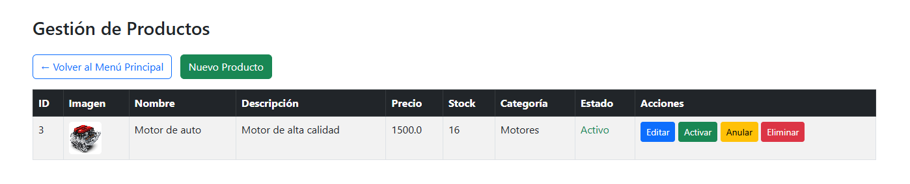

# Implementación de nuevas vistas

# Nuevas entidades para la base de datos - ROLES
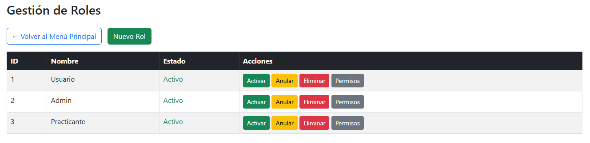

# Nuevas entidades para la base de datos - Ventas
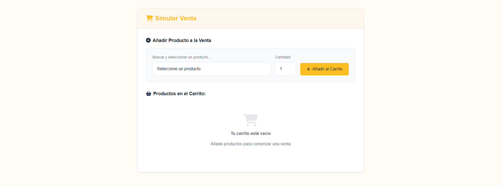

# Nuevos controladores
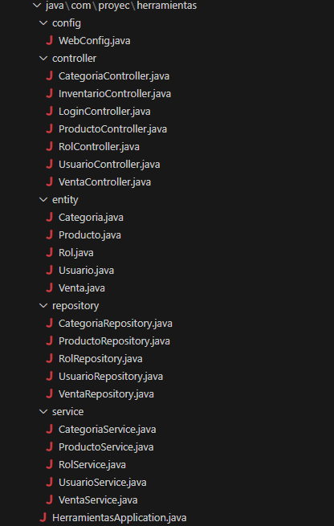

# Nuevas vistas
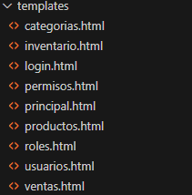

# Se mejoró el estilo de la pagina para hacerla más agradable a la vista
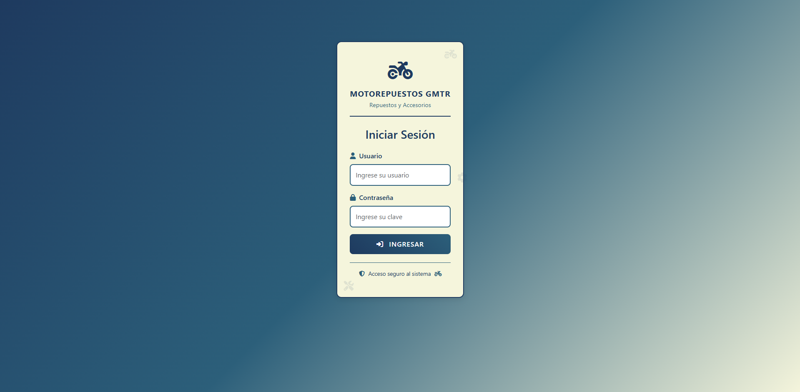

# Mas estilos de la página

# Las imagenes ahora se almacenan en una nueva capeta llamada uploads/productos
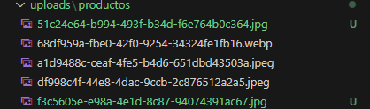

# Segundo Avance del proyecto del curso Herramientas de Desarrollo

# Plataforma usada para la comunicación
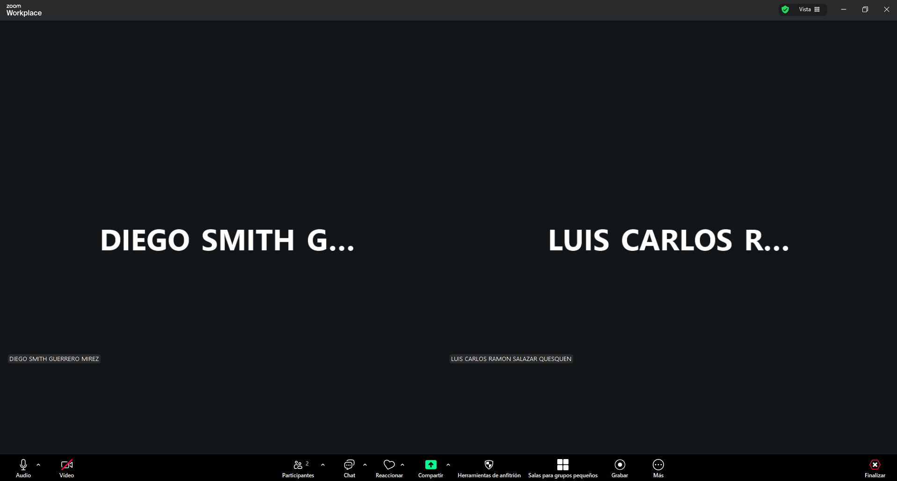

# Plataforma usada para la organización del proyecto
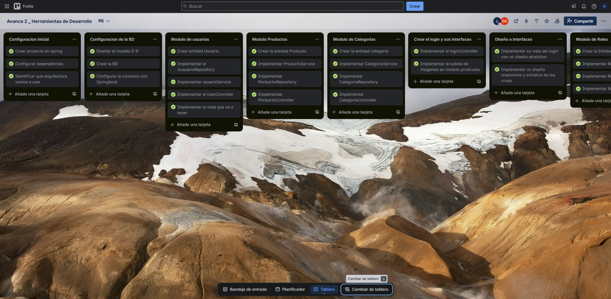
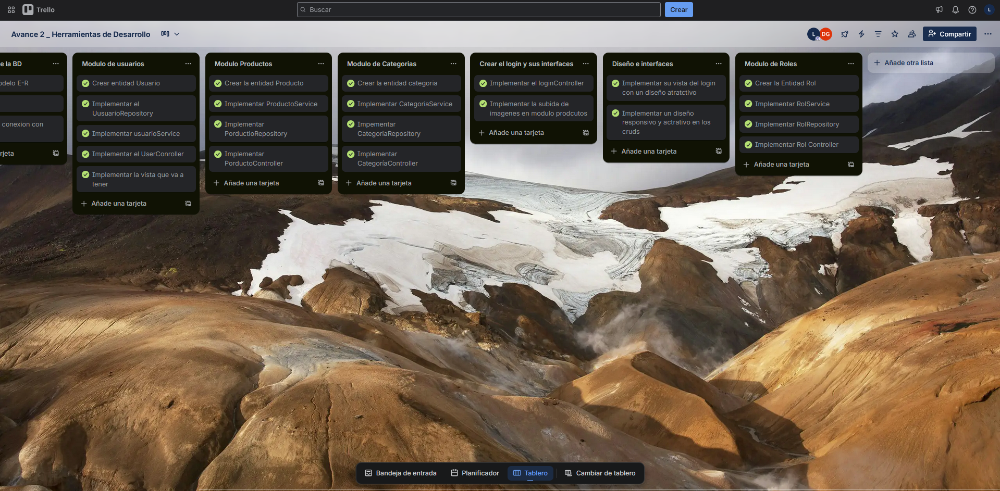

# Conflicto al unir ramas
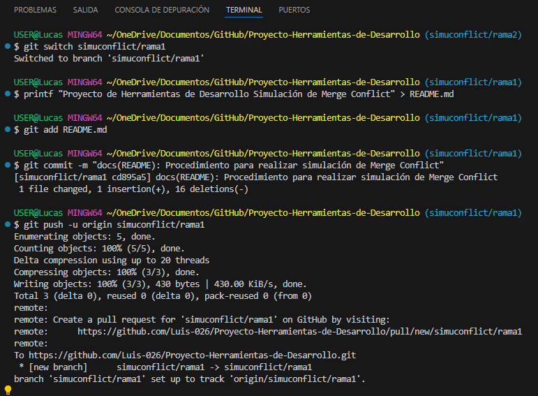
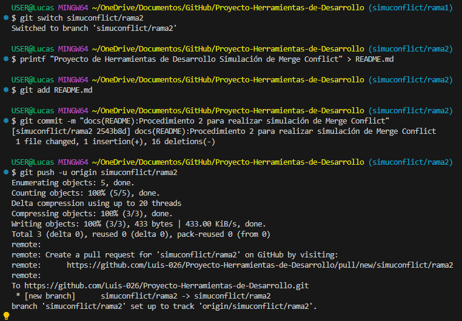
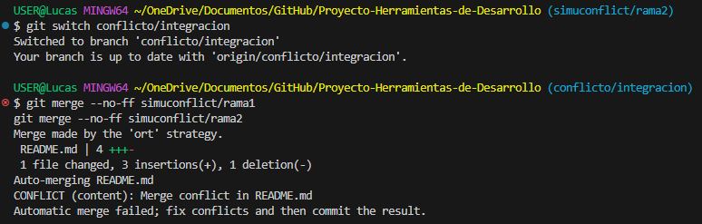
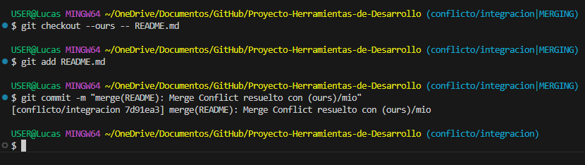

# Commits realizados para la subida de avances del proyecto
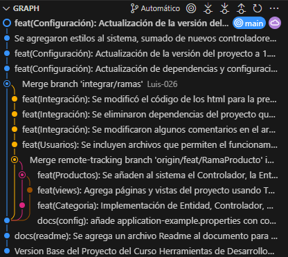

# Versión anterior del proyecto (1.0)
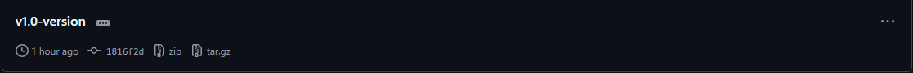

# Versión anterior del proyecto (1.1)
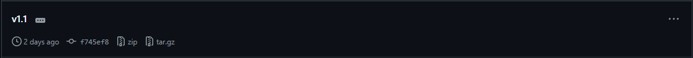

# Las proximas actualizaciones del proyecto serán mencionadas en este archivo.